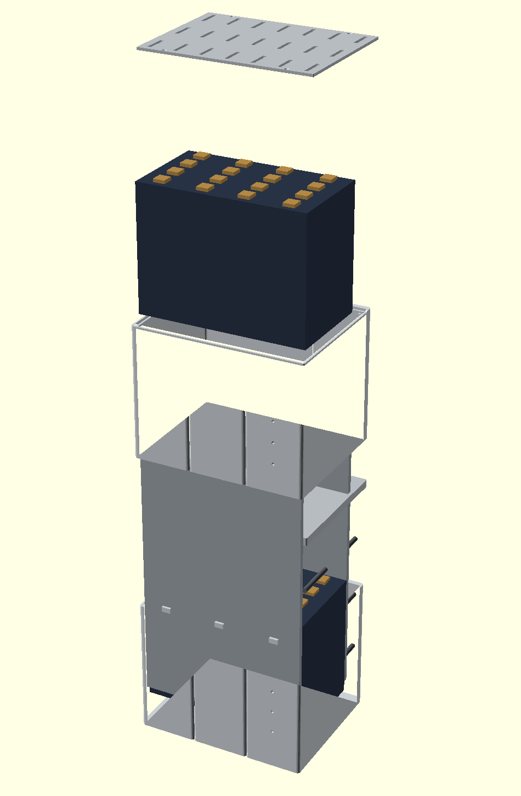

# Zellblock 16

**Ein selbstgebauter Traktionsakku für den Kumpan 54 ignite.**
16 LiFePO4-Zellen in Reihe, 5,38 kWh, in einem 3D-gedruckten Gehäuse, das
die drei originalen Wechselakkus ersetzt.

<p align="center">
  
</p>

---

## Worum es geht

Der Kumpan 54 ignite fährt mit bis zu drei Wechselakkus vom Typ Kraftpaket 2.0.
Sie altern, zeigen Fehler, und ihr Batteriemanagement ist auf ein
Flottenmanagement-Backend ausgelegt, das nicht mehr verlässlich erreichbar ist.
Ersatz gibt es — zu **1.400 € pro Stück**.

| | Original, 3 Packs | Zellblock 16 |
|---|---:|---:|
| Preis | 4.200 € | **~1.500 €** |
| Energie | 4,33 kWh | **5,38 kWh** |
| je kWh | 970 € | **282 €** |
| Zyklen | ~1.000 | **> 6.000** |
| Ersatz einer defekten Zelle | ganzer Pack, 1.400 € | eine Zelle, **40 €** |

Am deutlichsten wird es an einem einzelnen Pack: Einer kostet 1.400 € und
liefert 1,44 kWh. Der komplette Eigenbau kostet 1.515 € und liefert 5,38 kWh —
**das 3,7-fache an Energie für 8 % mehr Geld.**

---

## Kenndaten

| | |
|---|---|
| Konfiguration | 16S1P LiFePO4 |
| Zelle | EVE LF105, 105 Ah, 3,2 V |
| Nennspannung | 51,2 V, Ladeschluss 58,4 V |
| Energie | 5,38 kWh |
| Dauerstrom / Spitze | 100 A / 180 A |
| Masse | 43,2 kg |
| Außenmaß | 270 × 215 × 430 mm |
| Reichweite, rechnerisch | ~96 km |

---

## Der Aufbau

**Metall trägt, Kunststoff hüllt.** Zwei durchgehende Aluminiumplatten über die
volle Bauhöhe, verbunden durch acht waagerechte Gewindestangen, nehmen die
Zellverspannung auf. Das gedruckte Gehäuse überträgt keine Kräfte — es ist
Hülle, Führung im Schacht und Isolierung gegen den Rahmen.

Die Zellen stehen in **zwei Etagen zu je acht**, angeordnet als zwei Stapel von
vier. Sie quellen über ihre Lebensdauer in Dickenrichtung auf und werden deshalb
mit **3–5 kN je Stapel** vorgespannt; am Lebensende entwickeln sie bis zu 30 kN.

### Drei Zahlen, an denen die Konstruktion hängt

**Die Außenkontur ist keine Erfindung, sondern eine Ableitung.** Sie ist die
Vereinigungsmenge der drei Original-Fachgrundrisse — 90 × 215 mm mit 5 mm
Eckradius, dreimal nebeneinander. Wo zwei Fächer aneinanderstoßen, treffen an
Vorder- und Rückkante zwei Viertelrundungen aufeinander, und dazwischen bleibt
eine Einbuchtung stehen. Genau dort greifen die Führungsrippen des Schachts ein.
**Diese Nuten entstehen von selbst; sie werden nicht konstruiert.** Deshalb passt
die Kontur per Konstruktion, und am Fahrzeug muss nichts gefräst werden.

**Die Höhenbilanz geht mit 425 von 430 mm auf** — aber nur, weil die
Zwischenplatte die 5 mm überstehenden Zellpole samt Busbars und Muttern in
Kanälen aufnimmt, statt sie obendrauf zu addieren. Naiv gerechnet wären es
436 mm, und das Projekt wäre gescheitert.

**In der Breite bleiben 1,7 mm Spiel je Seite** bei einer Drucktoleranz von
±0,4 mm. Deshalb geht dem Vollteil ein Testring voraus.

---

## Dokumente

| Datei | Inhalt |
|---|---|
| [`grundlagen.md`](grundlagen.md) | Faktenbasis. **Jede Zahl trägt eine Herkunftsmarke** — Herstellerdokument, Messung, Berechnung, Recherche oder offener Punkt. |
| [`konstruktion.md`](konstruktion.md) | Konstruktionsspezifikation: Zellen, Anordnung, Skelett, Kräfte, Gehäuse, Elektrik, Montagereihenfolge |
| [`kosten.md`](kosten.md) | Kostenabschätzung, brutto, mit wahrscheinlichem Wert |
| [`messprotokoll.md`](messprotokoll.md) | Was am Fahrzeug noch zu messen ist |
| [`cad/`](cad/) | Parametrisches OpenSCAD-Modell |
| [`spezifikation.md`](spezifikation.md) | Erster Entwurf, **veraltet** — enthält an neun Stellen widerlegte Werte und bleibt nur als Diskussionsverlauf erhalten |

Die Belegmarken in `grundlagen.md` sind der Kern der Dokumentation. Der erste
Entwurf scheiterte daran, dass abgeleitete Forenzahlen und belegte
Herstellerangaben ununterscheidbar nebeneinanderstanden — ein aus einer
ungenauen Anzeige geschätzter Spitzenstrom von 240 A schlug unbemerkt bis in
eine Lieferantenanfrage durch. Der belegte Wert liegt bei 180 A.

---

## CAD

```sh
cd cad
openscad -o testring.stl --export-format binstl testring.scad
openscad -D 'teil="unten"' -o segment_unten.stl --export-format binstl gehaeuse.scad
```

Alle Maße stehen ausschließlich in [`cad/parameter.scad`](cad/parameter.scad).
Ändert sich eines, pflanzt es sich durch alle Teile fort. `assert`-Prüfungen
brechen ab, wenn eine Änderung die Konstruktion unmöglich macht — etwa wenn das
Spiel in der Breite unter die doppelte Drucktoleranz fällt oder die Stirnwand so
dünn wird, dass die Zwickelnut sie durchbricht.

| Teil | Material | Druckzeit |
|---|---:|---:|
| Segment unten | 1,53 kg | ~14,8 h |
| Segment oben | 1,17 kg | ~11,3 h |
| Zwischenplatte | 0,45 kg | ~4,4 h |
| Deckel | 0,20 kg | ~1,9 h |
| **Gesamt** | **3,36 kg** | **~32 h** |

Werkstoff ASA wegen der Sommertemperaturen im Akkuschacht; für den Testring
genügt PETG. Gedruckt auf einem BambuLab H2S — dessen Bauhöhe von 340 mm ist der
Grund für die Zweiteilung des Gehäuses.

---

## Stand

Konstruktion abgeschlossen, Fertigung noch nicht begonnen.

- [x] Faktenbasis aus dem Herstellerdokument
- [x] Zellwahl und Anordnung
- [x] Gehäuse, Zwischenplatte, Deckel als parametrisches Modell
- [ ] **Testring drucken und Passung prüfen** ← hier steht das Projekt
- [ ] Zellen und BMS bestellen
- [ ] Gehäuse drucken
- [ ] Aufbau und Inbetriebnahme
- [ ] Abnahme durch eine Prüforganisation

---

## Sicherheit

Es wird mit **58,4 V DC** und Kurzschlussströmen im Kiloampere-Bereich
gearbeitet, an einem Paket von 43 kg. Lithiumzellen können bei Fehlbehandlung in
Brand geraten.

Dieses Repository ist **keine Bauanleitung**. Es dokumentiert ein Einzelprojekt
an einem konkreten Fahrzeug. Wer Vergleichbares vorhat, prüft jede Zahl selbst
gegen seine eigenen Bauteile und Datenblätter.

Der Umbau berührt **Betriebserlaubnis und Versicherungsschutz**. Vor der
Nutzung im öffentlichen Straßenverkehr ist eine Prüforganisation einzuschalten.

---

## Dank

An **Raffler** aus dem Elektroroller-Forum für das CAN-Modul, das den
Motorcontroller ohne das originale Batteriemanagement freigibt, und für
Auskünfte, die kein Handbuch enthält: dass alle drei Anschlüsse parallel liegen,
dass jeder 100 A trägt, und dass der Roller über die Datenpins prüft, ob ein
Stromkreis geschlossen ist.

An **JJac**, dessen dokumentierter Umbau an einem 54 Ri zeigte, dass der Weg
überhaupt gangbar ist.

---

## Lizenz

Noch nicht festgelegt. Bis dahin gilt: alle Rechte vorbehalten.
